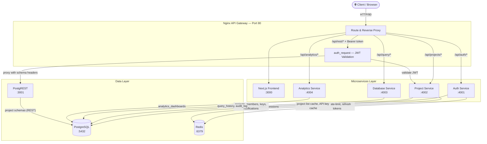
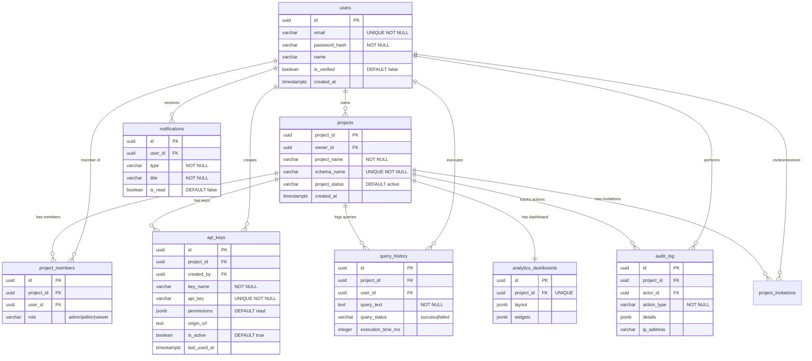

<](./LICENSE)
[](./docker-compose.yml)
[](./.github/workflows/ci.yml)
[](https://www.postgresql.org/)
[](https://postgrest.org/)

> **Developed by [Ayush Soni](https://github.com/ayushsoni1010)**

[Features](#-features) · [Quick Start](#-quick-start) · [API Docs](#-api-documentation) · [PostgREST API](#-postgrest-auto-generated-rest-api) · [Architecture](#-architecture)

</div>

---

## 🎯 What is RapidBase?

RapidBase is a **self-hosted, multi-tenant Backend-as-a-Service** — an open-source alternative to Firebase and Supabase. It gives you:

- **Instant PostgreSQL database** with schema-level isolation per project
- **Auto-generated REST API** via PostgREST — no backend code needed
- **Built-in authentication** with JWT, OTP email verification, and refresh tokens
- **Dashboard UI** for managing tables, running SQL, viewing analytics, and team collaboration

Deploy the entire platform with a single `docker compose up -d` command.

---

## ✨ Features

| Feature | Description |
|---------|-------------|
| 🗄️ **Multi-Tenant Databases** | Every project gets a dedicated PostgreSQL schema (e.g., `proj_ki1jw9xf`). Complete data isolation. |
| 🔌 **Auto-Generated REST API** | PostgREST turns your tables into REST endpoints at `/api/rest/`. Insert, filter, paginate — zero config. |
| 🔐 **JWT Authentication** | Register, login, OTP verify, password reset, refresh tokens — all built-in with rate limiting. |
| 🔑 **JWT API Keys** | Generate scoped API keys with granular permissions (`read`, `insert`, `update`, `delete`) and origin whitelisting. |
| ✏️ **SQL Editor** | Execute raw SQL with syntax highlighting, query history, execution time tracking, and audit logging. |
| 👥 **Team Collaboration** | Invite members as Admin, Editor, or Viewer. Email invitations with accept/decline workflow. |
| 📊 **Analytics Dashboard** | Build custom charts and widgets. Drag-and-drop dashboard layouts saved per project. |
| 🔔 **Real-time Notifications** | Server-Sent Events via Redis Pub/Sub for instant alerts on invitations and project updates. |
| 🗺️ **Schema Visualization** | Interactive ER diagrams with React Flow showing tables, columns, and relationships. |
| 📋 **Audit Logging** | Every action tracked — table changes, member updates, SQL queries — with IP and timestamps. |
| 🚀 **CI/CD Pipeline** | GitHub Actions with Trivy vulnerability scanning, Docker builds, and auto-push to Docker Hub. |
| ⚡ **Redis Caching** | OTP codes, API key validation, project lists, and rate limiting all cached in Redis. |

---

## 🚀 Quick Start

### Prerequisites

| Tool | Version | Purpose |
|------|---------|---------|
| Docker | 24+ | Container runtime |
| Docker Compose | v2+ | Multi-container orchestration |
| Git | 2+ | Source control |

### 1. Clone & Configure

```bash
git clone https://github.com/ayushsoni1010/rapidbase.git
cd rapidbase
cp .env.example .env
```

Edit `.env` — fill in secrets (use `openssl rand -hex 64` to generate):

| Variable | Description |
|----------|-------------|
| `POSTGRES_PASSWORD` | PostgreSQL password (min 32 chars) |
| `JWT_SECRET` | JWT signing secret (min 64 chars) |
| `JWT_REFRESH_SECRET` | Refresh token secret (min 64 chars) |
| `COOKIE_SECRET` | Cookie session secret (min 32 chars) |
| `REDIS_PASSWORD` | Redis password |
| `SMTP_*` | SMTP credentials for OTP emails (leave blank for Ethereal dev mode) |

### 2. Start Everything

```bash
docker compose up -d
```

### 3. Access

| Service | URL |
|---------|-----|
| 🌐 Dashboard | http://localhost/ |
| 🔌 REST API (via Nginx) | http://localhost/api/* |
| 📡 PostgREST API | http://localhost/api/rest/* |
| 🗄️ pgAdmin | http://localhost:5050/ |
| 📊 Redis Insight | http://localhost:8001/ |

### 4. Your First Project (5 minutes)

1. **Sign up** at http://localhost/signup — verify email with OTP
2. **Create a project** — click "New Project" on the dashboard
3. **Create a table** — use the visual table builder or SQL Editor
4. **Generate an API key** — go to API Keys → Generate New Key → choose permissions
5. **Query your data** — use the JWT token to call `/api/rest/your_table`

```bash
# Example: Read all rows from your "users" table
curl "http://localhost/api/rest/users" \
  -H "Authorization: Bearer <your_jwt_token>"
```

---

## 🛡️ Tech Stack

| Layer | Technology | Purpose |
|-------|-----------|---------|
| **Frontend** | Next.js (App Router), TailwindCSS v4 | Dashboard UI with animations (Framer Motion) |
| **Gateway** | Nginx | Reverse proxy, API routing, JWT validation via auth_request |
| **Auth** | Node.js + Express | JWT, refresh tokens, OTP, password reset, rate limiting |
| **Projects** | Node.js + Express | CRUD, members, invitations, notifications (SSE), API keys |
| **Database** | Node.js + Express | SQL execution, query history, audit logging |
| **Analytics** | Node.js + Express | Chart builder, table stats, dashboard CRUD |
| **REST API** | PostgREST v12.2 | Auto-generated CRUD from PostgreSQL schemas |
| **Database** | PostgreSQL 16 | Primary data store with schema-per-project isolation |
| **Cache** | Redis 7 | OTP, sessions, rate-limits, API key cache, Pub/Sub |
| **CI/CD** | GitHub Actions | Trivy scans, Docker builds, Docker Hub push |
| **IaC** | Terraform | AWS EC2 provisioning |

---

## 📖 API Documentation

All requests go through the Nginx API Gateway at port 80. Authentication uses `Authorization: Bearer <token>` or HTTP-only cookies set during login.

### Authentication Service — `/api/auth/*`

| Method | Endpoint | Auth | Description |
|--------|----------|:----:|-------------|
| `POST` | `/api/auth/register` | ❌ | Register (sends OTP to email) |
| `POST` | `/api/auth/verify-otp` | ❌ | Verify OTP → receive JWT + refresh token |
| `POST` | `/api/auth/resend-otp` | ❌ | Resend OTP (10/hr limit) |
| `POST` | `/api/auth/login` | ❌ | Login with email + password |
| `POST` | `/api/auth/refresh` | ❌ | Refresh JWT tokens |
| `POST` | `/api/auth/logout` | ❌ | Logout & invalidate refresh token |
| `POST` | `/api/auth/forgot-password` | ❌ | Send password reset link via email |
| `POST` | `/api/auth/reset-password` | ❌ | Reset password with reset token |
| `GET` | `/api/auth/me` | ✅ | Get current user profile |
| `PATCH` | `/api/auth/profile` | ✅ | Update name, avatar |
| `POST` | `/api/auth/change-password` | ✅ | Change password |
| `DELETE` | `/api/auth/account` | ✅ | Permanently delete account |

### Project Service — `/api/projects/*`

#### Projects

| Method | Endpoint | Role | Description |
|--------|----------|:----:|-------------|
| `GET` | `/api/projects/` | any | List my projects (cached in Redis) |
| `POST` | `/api/projects/` | any | Create project + auto-provision schema |
| `GET` | `/api/projects/:id` | any | Get project details |
| `PATCH` | `/api/projects/:id` | admin | Update project name/description |
| `DELETE` | `/api/projects/:id` | owner | Delete project + drop schema |

#### Tables & Schema

| Method | Endpoint | Role | Description |
|--------|----------|:----:|-------------|
| `GET` | `/api/schema/:projectId` | any | Full schema structure |
| `GET` | `/api/projects/:id/tables` | any | List tables |
| `POST` | `/api/projects/:id/tables` | admin/editor | Create table |
| `GET` | `/api/projects/:id/tables/:name` | any | Get table columns |
| `PATCH` | `/api/projects/:id/tables/:name` | admin/editor | Alter table (add/drop/rename columns) |
| `DELETE` | `/api/projects/:id/tables/:name` | admin | Drop table |

#### Table Data (UI CRUD)

| Method | Endpoint | Role | Description |
|--------|----------|:----:|-------------|
| `GET` | `/api/projects/:id/tables/:name/data` | any | Paginated row read |
| `POST` | `/api/projects/:id/tables/:name/data` | admin/editor | Insert row |
| `PATCH` | `/api/projects/:id/tables/:name/rows` | admin/editor | Update row |
| `DELETE` | `/api/projects/:id/tables/:name/rows` | admin/editor | Delete row |

#### Members & Invitations

| Method | Endpoint | Role | Description |
|--------|----------|:----:|-------------|
| `GET` | `/api/projects/:id/members` | any | List project members |
| `POST` | `/api/projects/:id/members` | admin | Invite member (sends email) |
| `PATCH` | `/api/projects/:id/members/:mid` | admin | Update member role |
| `DELETE` | `/api/projects/:id/members/:mid` | admin | Remove member |
| `GET` | `/api/projects/invitations/mine` | any | My pending invitations |
| `POST` | `/api/projects/invitations/accept/:token` | any | Accept invitation |
| `POST` | `/api/projects/invitations/decline/:token` | any | Decline invitation |

#### Notifications

| Method | Endpoint | Description |
|--------|----------|-------------|
| `GET` | `/api/projects/notifications` | List all notifications |
| `GET` | `/api/projects/notifications/unread-count` | Unread count |
| `GET` | `/api/projects/notifications/stream` | **SSE stream** (real-time via Redis Pub/Sub) |
| `PATCH` | `/api/projects/notifications/mark-all-read` | Mark all read |
| `PATCH` | `/api/projects/notifications/:id/read` | Mark single read |

#### API Keys

| Method | Endpoint | Role | Description |
|--------|----------|:----:|-------------|
| `GET` | `/api/projects/:id/keys` | any | List API keys (prefix only) |
| `POST` | `/api/projects/:id/keys` | admin | Generate new JWT API key |
| `DELETE` | `/api/projects/:id/keys/:keyId` | admin | Revoke API key |

### Database Service — `/api/query/*`

| Method | Endpoint | Description |
|--------|----------|-------------|
| `POST` | `/api/query/execute` | Execute raw SQL against project schema |
| `GET` | `/api/query/history?projectId=uuid` | Query history for a project |
| `GET` | `/api/auditlog?projectId=uuid` | Project audit log |

### Analytics Service — `/api/analytics/*`

| Method | Endpoint | Description |
|--------|----------|-------------|
| `GET` | `/api/analytics/tables?projectId=uuid` | List tables for analytics |
| `GET` | `/api/analytics/tables/:name/columns?projectId=uuid` | List columns |
| `GET` | `/api/analytics/chart?projectId&tableName&xAxis&yAxis&aggregation` | Chart data |
| `GET` | `/api/analytics/stats?projectId&tableName` | Table stats |
| `GET` | `/api/analytics/dashboard?projectId=uuid` | Get dashboard config |
| `POST` | `/api/analytics/dashboard` | Save dashboard config |

---

## 📡 PostgREST Auto-Generated REST API

PostgREST provides **instant, high-performance REST access** to all your project tables. Every request is authenticated via a **JWT API key** generated from the dashboard.

### How It Works

1. You **create a table** in your project (via UI or SQL Editor)
2. PostgREST **instantly exposes** it at `/api/rest/{table_name}`
3. You **generate a JWT API key** with specific permissions from the API Keys page
4. Your key is validated by nginx → project-service, then the request is routed to PostgREST with the correct schema

### Authentication

Every request requires a JWT token in the `Authorization` header:

```bash
curl -H "Authorization: Bearer YOUR_JWT_TOKEN" http://YOUR_DOMAIN/api/rest/your_table
```

**JWT Token Structure:**
```json
{
  "kid": "api-key-id",
  "pid": "project-id",
  "schema": "proj_ki1jw9xf",
  "perms": ["read"],
  "origin": null
}
```

**Permission Enforcement:**
| HTTP Method | Required Permission | Example |
|-------------|-------------------|---------|
| `GET` / `HEAD` | `read` | Read rows from a table |
| `POST` | `insert` | Insert new rows |
| `PATCH` / `PUT` | `update` | Update existing rows |
| `DELETE` | `delete` | Delete rows |

A key with only `["read"]` permission **cannot** insert data (returns 403). A key with only `["insert"]` permission **cannot** read data (returns 403).

### Read Records

```bash
# Get all rows
curl "http://YOUR_DOMAIN/api/rest/users" \
  -H "Authorization: Bearer YOUR_TOKEN"

# Select specific columns
curl "http://YOUR_DOMAIN/api/rest/users?select=id,email" \
  -H "Authorization: Bearer YOUR_TOKEN"

# Filter: exact match
curl "http://YOUR_DOMAIN/api/rest/users?id=eq.5" \
  -H "Authorization: Bearer YOUR_TOKEN"

# Filter: greater than
curl "http://YOUR_DOMAIN/api/rest/users?age=gt.18" \
  -H "Authorization: Bearer YOUR_TOKEN"

# Filter: pattern match (case-insensitive)
curl "http://YOUR_DOMAIN/api/rest/users?name=ilike.*john*" \
  -H "Authorization: Bearer YOUR_TOKEN"

# Sort + Pagination
curl "http://YOUR_DOMAIN/api/rest/users?order=created_at.desc&limit=10&offset=0" \
  -H "Authorization: Bearer YOUR_TOKEN"
```

### Insert Records

```bash
# Single row
curl -X POST "http://YOUR_DOMAIN/api/rest/users" \
  -H "Authorization: Bearer YOUR_TOKEN" \
  -H "Content-Type: application/json" \
  -H "Prefer: return=representation" \
  -d '{"username": "johndoe", "email": "john@example.com", "password_hash": "hashed_pw"}'

# Multiple rows
curl -X POST "http://YOUR_DOMAIN/api/rest/users" \
  -H "Authorization: Bearer YOUR_TOKEN" \
  -H "Content-Type: application/json" \
  -d '[{"username": "alice"}, {"username": "bob"}]'
```

### Update Records

```bash
curl -X PATCH "http://YOUR_DOMAIN/api/rest/users?id=eq.1" \
  -H "Authorization: Bearer YOUR_TOKEN" \
  -H "Content-Type: application/json" \
  -d '{"username": "updated_name"}'
```

> ⚠️ Always include a filter (`?id=eq.X`), otherwise **ALL rows** will be updated.

### Delete Records

```bash
curl -X DELETE "http://YOUR_DOMAIN/api/rest/users?id=eq.1" \
  -H "Authorization: Bearer YOUR_TOKEN"
```

> ⚠️ Always include a filter, otherwise **ALL rows** will be deleted.

### JavaScript Example

```javascript
const API_URL = "http://YOUR_DOMAIN/api/rest";
const TOKEN = "YOUR_JWT_TOKEN";

const headers = {
  "Authorization": `Bearer ${TOKEN}`,
  "Content-Type": "application/json",
  "Prefer": "return=representation",
};

// Read all users (requires: read permission)
const users = await fetch(`${API_URL}/users`, { headers }).then(r => r.json());

// Read with filter (requires: read permission)
const active = await fetch(`${API_URL}/users?status=eq.active&order=name.asc`, { headers })
  .then(r => r.json());

// Insert (requires: insert permission)
const newUser = await fetch(`${API_URL}/users`, {
  method: "POST", headers,
  body: JSON.stringify({ username: "newuser", email: "new@test.com", password_hash: "hashed" }),
}).then(r => r.json());

// Update (requires: update permission)
await fetch(`${API_URL}/users?id=eq.${newUser[0].id}`, {
  method: "PATCH", headers,
  body: JSON.stringify({ username: "updated" }),
});

// Delete (requires: delete permission)
await fetch(`${API_URL}/users?id=eq.${newUser[0].id}`, {
  method: "DELETE", headers,
});
```

### Python Example

```python
import requests

API = "http://YOUR_DOMAIN/api/rest"
HEADERS = {"Authorization": "Bearer YOUR_JWT_TOKEN"}

# Read
users = requests.get(f"{API}/users", headers=HEADERS).json()

# Read with filter
active = requests.get(f"{API}/users?status=eq.active", headers=HEADERS).json()

# Insert
requests.post(f"{API}/users",
    headers={**HEADERS, "Content-Type": "application/json"},
    json={"username": "bob", "email": "bob@example.com", "password_hash": "hashed"}
)

# Update
requests.patch(f"{API}/users?id=eq.1",
    headers={**HEADERS, "Content-Type": "application/json"},
    json={"username": "bob_updated"}
)

# Delete
requests.delete(f"{API}/users?id=eq.1", headers=HEADERS)
```

### Filter Operators Reference

| Operator | Meaning | Example |
|----------|---------|---------|
| `eq` | Equals | `?id=eq.5` |
| `neq` | Not equal | `?status=neq.deleted` |
| `gt` / `lt` | Greater / Less than | `?age=gt.18` |
| `gte` / `lte` | Greater/Less or equal | `?price=lte.100` |
| `like` | Pattern match (case-sensitive) | `?name=like.*john*` |
| `ilike` | Pattern match (case-insensitive) | `?name=ilike.*john*` |
| `in` | In list | `?status=in.(active,pending)` |
| `is` | IS (null/true/false) | `?deleted_at=is.null` |

### Response Codes

| Code | Meaning |
|------|---------|
| `200` | Success (GET, PATCH) |
| `201` | Created (POST with `Prefer: return=representation`) |
| `204` | Success, no content returned |
| `401` | Invalid or missing API key |
| `403` | Permission denied or wrong origin |
| `404` | Table not found |
| `409` | Unique constraint violation |

---

## 🏗️ Architecture

### System Flow Diagram


### PostgREST Request Flow

```
Client Request
    │  GET /api/rest/users
    │  Header: Authorization: Bearer <jwt_token>
    ▼
┌─────────────────────────────────┐
│  Nginx Gateway (Port 80)       │
│  1. Match /api/rest/* location  │
│  2. auth_request → /_validate  │
└──────────┬──────────────────────┘
           ▼
┌─────────────────────────────────┐
│  Project Service (Port 4002)   │
│  1. Verify JWT signature       │
│  2. Extract schema + perms     │
│  3. Check key not revoked      │
│  4. Block public schema        │
│  5. Validate origin            │
│  6. Check method permission    │
│  7. Return X-Schema-Name header│
└──────────┬──────────────────────┘
           ▼
┌─────────────────────────────────┐
│  Nginx (continued)             │
│  1. Strip auth headers         │
│  2. Set Accept-Profile header  │
│  3. Set Content-Profile header │
│  4. Proxy to PostgREST:3001    │
└──────────┬──────────────────────┘
           ▼
┌─────────────────────────────────┐
│  PostgREST (Port 3001)         │
│  1. Read Accept-Profile schema │
│  2. Execute query in schema    │
│  3. Return JSON response       │
└─────────────────────────────────┘
```

### ER Diagram (Core Entities)


> **Note:** OTP codes and refresh tokens are stored in **Redis** (not PostgreSQL) for fast access and automatic TTL expiry.

---

## 🔄 CI/CD Pipeline — GitHub Actions

The pipeline at [`.github/workflows/ci.yml`](.github/workflows/ci.yml) triggers on every push/PR to `main`:

```
Push to main
    │
    ▼
┌──────────────────────┐
│  1. Filesystem Scan  │  ← Trivy scans for HIGH/CRITICAL CVEs
└──────────┬───────────┘
           │
    ┌──────▼──────────────────────────┐
    │  2. Build & Push (6 services)   │  ← Parallel: build → scan → push
    │  auth · project · database      │
    │  analytics · nginx · frontend   │
    └──────┬──────────────────────────┘
           │
    ┌──────▼──────────────────┐
    │  3. Email Notification  │  ← Success/failure via Gmail SMTP
    └─────────────────────────┘
```

### Required GitHub Secrets

| Secret | Description |
|--------|-------------|
| `DOCKERHUB_USERNAME` | Docker Hub username |
| `DOCKERHUB_TOKEN` | Docker Hub Access Token |
| `MAIL_USERNAME` | Gmail address for CI alerts |
| `MAIL_PASSWORD` | Gmail App Password |
| `ALERT_EMAIL_ADDRESS` | Recipient email |

### Deploy to Server

```bash
# After CI pushes new images:
docker compose pull && docker compose up -d
```

---

## ☁️ Infrastructure — Terraform (AWS)

The [`terraform/`](./terraform/) directory provisions:
- EC2 instance (`m7i-flex.large`, 30GB gp3 SSD)
- Security group (ports 22, 80, 5050, 8001)
- SSH key pair + Docker auto-install

```bash
cd terraform/
terraform init
terraform plan
terraform apply
```

After apply → SSH in → clone repo → `docker compose up -d`.

```bash
# Tear down
terraform destroy
```

---

## 📂 Project Structure

```
rapidbase/
├── frontend/              # Next.js dashboard (App Router + TailwindCSS v4)
├── services/
│   ├── nginx-gateway/     # Nginx config (reverse proxy + JWT validation)
│   ├── auth-service/      # Registration, login, OTP, JWT, password reset (Distroless)
│   ├── project-service/   # Projects, tables, members, invitations, API keys (Distroless)
│   ├── database-service/  # SQL execution, query history, audit logs (Distroless)
│   └── analytics-service/ # Charts, stats, dashboard CRUD (Distroless)
├── docker/
│   └── postgres/init.sql  # Database initialization script
├── terraform/             # AWS infrastructure (EC2 + Security Group)
├── .github/workflows/     # CI/CD pipeline
├── docker-compose.yml     # Full platform orchestration
└── .env.example           # Environment template
```

---

## 📄 License

This project is licensed under the **MIT License** — see [LICENSE](./LICENSE).

```
MIT License — Copyright (c) 2026 Ayush Soni
```
]]>
