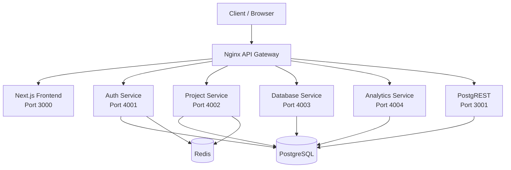

# RapidBase - The Open-Source Backend for Rapid Development

> **Developed by Ayush Soni**

## Objective & Vision
RapidBase is a highly scalable, self-hosted, multi-tenant Backend-as-a-Service (BaaS) designed to be the ultimate open-source alternative to platforms like Firebase and Supabase. The core problem it solves is the complexity of configuring and managing multi-tenant architectures from scratch. RapidBase provides developers with a streamlined dashboard for project management, authentication, database auto-generation (via PostgREST), direct SQL execution, and comprehensive analytics—all isolated perfectly per tenant. The overall goal is to empower developers to launch production-ready applications with robust backend infrastructure and an intuitive management UI in minutes.

## Core Features
1. **Multi-Tenant Postgres Databases**: Instant schema isolation per project.
2. **Auto-Generated REST APIs**: Powered by PostgREST based on your schema.
3. **Advanced Authentication**: JWT, Refresh Tokens, and OTP-based Email authentication.
4. **SQL Editor**: Direct database execution with audit logging and history.
5. **Role-Based Access Control (RBAC)**: Admin, Editor, and Viewer roles for project members.
6. **Analytics & Dashboards**: Fully customizable grid layouts, real-time query metrics, and reporting.
7. **Developer API Keys**: Manage secure programmatic access to projects.
8. **Real-time Notifications**: Invitation systems and system alerts.

## Tech Stack & Module Deep-Dive
- **Next.js (App Router)**: The frontend framework showcasing a highly responsive, animated dashboard UI (TailwindCSS v4, React Flow, Mermaid).
- **Node.js & Express**: Microservices architecture for modular performance handling Auth, Projects, Database querying, and Analytics.
- **PostgreSQL**: The primary relational database ensuring strict schema-level multi-tenancy.
- **Redis**: Caching session states, user rate-limiting, and managing rapid OTP requests to prevent API abuse.
- **PostgREST**: Instantly turns the PostgreSQL database into a RESTful API, eliminating endless CRUD boilerplate.
- **Nginx**: Serving as an API Gateway, Reverse Proxy, and Load Balancer to securely route incoming traffic dynamically.
- **Docker & Docker Compose**: Containerizing the entire platform, making local development, testing, and production deployment reproducible.

## Architectural Diagrams

### System Flow Diagram


### ER Diagram (Core Entities)


## Comprehensive API Documentation

All requests interact with the platform through the unified Nginx API Gateway. Authentication is strictly handled via `Authorization: Bearer <token>` or HTTP-only cookies assigned during Login. All successful responses generally follow a `{ status, data, message }` envelope convention.

### 1. Authentication Service (`/api/auth/*`)
Manages user lifecycle, tokens, and profiles. Limits apply via Redis (e.g., 20 req/15min).

| Method | Endpoint | Input | Success Output | Description |
| :--- | :--- | :--- | :--- | :--- |
| `POST` | `/api/auth/register` | Body: `{ "email", "password", "name" }` | `201` - `{ "status", "data": { "userId" }, "message" }` | Register new user, sends OTP |
| `POST` | `/api/auth/verify-otp` | Body: `{ "email", "otp" }` | `200` - `{ "status", "data": { "user", "token", "refreshToken" } }` | Verify OTP to login |
| `POST` | `/api/auth/resend-otp` | Body: `{ "email" }` | `200` - `{ "status", "data": null, "message" }` | Resend OTP |
| `POST` | `/api/auth/login` | Body: `{ "email", "password" }` | `200` - `{ "status", "data": { "token", "refreshToken" } }` | Login user |
| `POST` | `/api/auth/refresh` | Body: `{ "refreshToken" }` | `200` - `{ "status", "data": { "token", "refreshToken" } }` | Refresh JWT tokens |
| `POST` | `/api/auth/logout` | None (Requires active session) | `200` - `{ "status", "data": null, "message" }` | Logout user |
| `GET` | `/api/auth/me` | Header: `Authorization: Bearer <token>` | `200` - `{ "status", "data": { "id", "email", "name", "verified" } }` | Get current user |
| `PATCH` | `/api/auth/profile` | Body: `{ "name" }` | `200` - `{ "status", "data": { "id", "name" }, "message" }` | Update profile |
| `POST` | `/api/auth/change-password` | Body: `{ "oldPassword", "newPassword" }` | `200` - `{ "status", "data": null, "message" }` | Change password |
| `DELETE` | `/api/auth/account` | None | `200` - `{ "status", "data": null, "message" }` | Delete account permanently |

### 2. Project Service (`/api/projects/*` & `/api/schema/*`)
Handles workspaces, schemas, table configuration, RBAC members, and keys. Requires Auth.

#### Projects
| Method | Endpoint | Input | Success Output | Description |
| :--- | :--- | :--- | :--- | :--- |
| `GET` | `/api/projects/` | Header: `Authorization: Bearer <token>` | `200` - `{ "status", "data": [ { "id", "name", "role", "createdAt" } ] }` | List projects |
| `POST` | `/api/projects/` | Body: `{ "name" }` | `201` - `{ "status", "data": { "id" }, "message" }` | Create project |
| `GET` | `/api/projects/:projectId` | Param: `projectId` | `200` - `{ "status", "data": { "id", "name", "ownerId", "schema" } }` | Get project details |
| `PATCH` | `/api/projects/:projectId` | Body: `{ "name" }` | `200` - `{ "status", "data": { ... }, "message" }` | Update project |
| `DELETE` | `/api/projects/:projectId` | Param: `projectId` | `200` - `{ "status", "data": null, "message" }` | Delete project |

#### Schema & Tables
| Method | Endpoint | Input | Success Output | Description |
| :--- | :--- | :--- | :--- | :--- |
| `GET` | `/api/schema/:projectId` | Param: `projectId` | `200` - `{ "status", "data": { "schema": [...] } }` | Get full schema |
| `GET` | `/api/projects/:projectId/tables` | Param: `projectId` | `200` - `{ "status", "data": [ "users", "products" ] }` | List tables |
| `POST` | `/api/projects/:projectId/tables` | Body: `{ "tableName", "columns": [...] }` | `201` - `{ "status", "data": null, "message" }` | Create table |
| `GET` | `/api/projects/:projectId/tables/:tableName` | Params: `projectId`, `tableName` | `200` - `{ "status", "data": { "columns": [...] } }` | Get table details |
| `PATCH` | `/api/projects/:projectId/tables/:tableName` | Body: `{ "actions": [...] }` | `200` - `{ "status", "data": null, "message" }` | Alter table |
| `DELETE` | `/api/projects/:projectId/tables/:tableName` | Params: `projectId`, `tableName` | `200` - `{ "status", "data": null, "message" }` | Drop table |

#### Table Data (UI CRUD Actions)
| Method | Endpoint | Input | Success Output | Description |
| :--- | :--- | :--- | :--- | :--- |
| `GET` | `/api/projects/:projectId/tables/:tableName/data` | Query: `?limit=50&offset=0` | `200` - `{ "status", "data": [ { "id": 1, "col": "val" } ] }` | Get rows |
| `POST` | `/api/projects/:projectId/tables/:tableName/data` | Body: `{ "row": { ... } }` | `201` - `{ "status", "data": { "id": 1 }, "message" }` | Insert row |
| `PATCH` | `/api/projects/:projectId/tables/:tableName/rows` | Body: `{ "id", "updates": { ... } }` | `200` - `{ "status", "data": null, "message" }` | Update row |
| `DELETE` | `/api/projects/:projectId/tables/:tableName/rows` | Option: Query or Body `{ "id" }` | `200` - `{ "status", "data": null, "message" }` | Delete row |

#### Members & Roles
| Method | Endpoint | Input | Success Output | Description |
| :--- | :--- | :--- | :--- | :--- |
| `GET` | `/api/projects/:projectId/members` | Param: `projectId` | `200` - `{ "status", "data": [ { "userId", "email", "role" } ] }` | List members |
| `POST` | `/api/projects/:projectId/members` | Body: `{ "email", "role" }` | `201` - `{ "status", "data": null, "message" }` | Invite member |
| `PATCH` | `/api/projects/:projectId/members/:memberId` | Body: `{ "role" }` | `200` - `{ "status", "message" }` | Update role |
| `DELETE` | `/api/projects/:projectId/members/:memberId` | Params: `projectId`, `memberId` | `200` - `{ "status", "message" }` | Remove member |

#### Invitations & Notifications
| Method | Endpoint | Input | Success Output | Description |
| :--- | :--- | :--- | :--- | :--- |
| `GET` | `/api/projects/invitations/mine` | None | `200` - `{ "status", "data": [ { "projectId", "role", "token" } ] }` | List my invites |
| `POST` | `/api/projects/invitations/accept/:token` | Param: `token` | `200` - `{ "status", "data": { "projectId" }, "message" }` | Accept invite |
| `POST` | `/api/projects/invitations/decline/:token` | Param: `token` | `200` - `{ "status", "message" }` | Decline invite |
| `GET` | `/api/projects/notifications` | None | `200` - `{ "status", "data": [ { "id", "title", "message", "isRead" } ] }` | List notifications |

#### API Keys
| Method | Endpoint | Input | Success Output | Description |
| :--- | :--- | :--- | :--- | :--- |
| `GET` | `/api/projects/:projectId/keys` | Param: `projectId` | `200` - `{ "status", "data": [ { "id", "createdAt", "lastUsedAt" } ] }` | List API keys |
| `POST` | `/api/projects/:projectId/keys` | None | `201` - `{ "status", "data": { "key" }, "message" }` | Create API key |
| `DELETE` | `/api/projects/:projectId/keys/:keyId` | Params: `projectId`, `keyId` | `200` - `{ "status", "message" }` | Revoke API key |

### 3. Database Service (`/api/query/*` & `/api/auditlog`)

| Method | Endpoint | Input | Success Output | Description |
| :--- | :--- | :--- | :--- | :--- |
| `POST` | `/api/query/execute` | Body: `{ "projectId", "query" }` | `200` - `{ "status", "data": { "rows", "rowCount", "executionTimeMs" } }` | Execute SQL query |
| `GET` | `/api/query/history` | Query: `?projectId=uuid` | `200` - `{ "status", "data": [ { "query", "executedBy", "timestamp" } ] }` | Query history |
| `GET` | `/api/auditlog` | Query: `?projectId=uuid` | `200` - `{ "status", "data": [ { "action", "details" } ] }` | Audit log |

### 4. Analytics Service (`/api/analytics/*`)

| Method | Endpoint | Input | Success Output | Description |
| :--- | :--- | :--- | :--- | :--- |
| `GET` | `/api/analytics/tables` | Query: `?projectId=uuid` | `200` - `{ "status", "data": [ "users", "orders" ] }` | List analytics tables |
| `GET` | `/api/analytics/tables/:tableName/columns` | Query: `?projectId=uuid` | `200` - `{ "status", "data": [ { "name", "type" } ] }` | List columns |
| `GET` | `/api/analytics/chart` | Query: `?projectId`, `tableName`, `xAxis`, `yAxis`, `aggregation` | `200` - `{ "status", "data": [ { "label", "value" } ] }` | Chart data |
| `GET` | `/api/analytics/stats` | Query: `?projectId`, `tableName` | `200` - `{ "status", "data": { "totalRecords", "recentlyAdded" } }` | Table stats |
| `GET` | `/api/analytics/dashboard` | Query: `?projectId=uuid` | `200` - `{ "status", "data": { "layout", "widgets" } }` | Get dashboard config |
| `POST` | `/api/analytics/dashboard` | Body: `{ "projectId", "layout", "widgets" }` | `200` - `{ "status", "data": null, "message" }` | Save dashboard config |

### 5. PostgREST Auto-Generated API (`/api/rest/*`)
Secured by passing the API Key in the `x-api-key` header. Standard PostgREST conventions apply.

| Method | Endpoint | Input | Success Output | Description |
| :--- | :--- | :--- | :--- | :--- |
| `GET` | `/api/rest/:tableName` | Header: `x-api-key`, Query: `?id=eq.5&select=id,name` | `200` - `[ { "id": 5, "name": "Data" } ]` | Read records |
| `POST` | `/api/rest/:tableName` | Header: `x-api-key`, Body: `{ "name", ... }` | `201` Created | Create records |
| `PATCH` | `/api/rest/:tableName` | Header: `x-api-key`, Query: `?id=eq.5`, Body: `{ ... }` | `204` No Content | Update records |
| `DELETE` | `/api/rest/:tableName` | Header: `x-api-key`, Query: `?id=eq.5` | `204` No Content | Delete records |

## Installation & Setup
Docker Compose orchestrates the entire application natively. 

1. **Clone & Configure:**
```bash
git clone <repository_url>
cd rapidbase
cp .env.example .env
```
*(Define database credentials, secure JWT/Session secrets, and SMTP setups in your `.env`)*

2. **Boot Platform:**
```bash
docker-compose up --build -d
```
All images (PostgreSQL, Redis, Services, Gateway, Next.js) will build securely.
- **Frontend Panel**: Available at `http://localhost/`
- **Backend APIs:** Secured heavily under `http://localhost/api/*` via Nginx Gateway boundaries.
