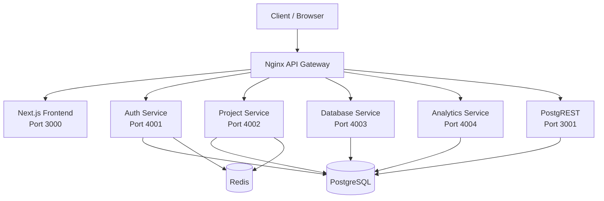
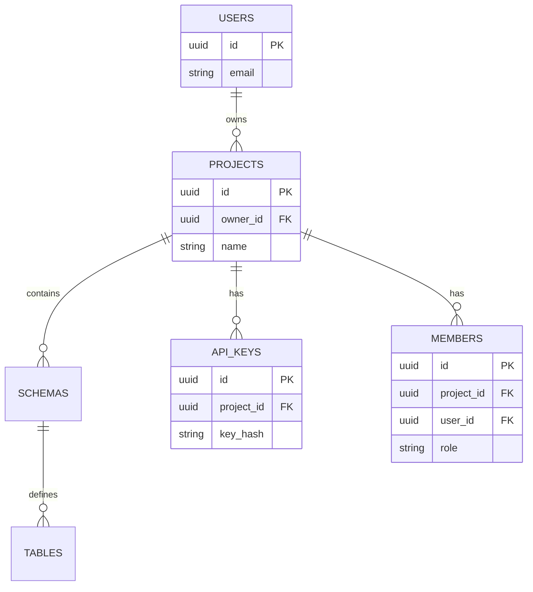

# RapidBase - The Open-Source Backend for Rapid Development

> **Developed by Ayush Soni**

## Objective & Vision
RapidBase is a highly scalable, self-hosted, multi-tenant Backend-as-a-Service (BaaS) designed to be the ultimate open-source alternative to platforms like Firebase and Supabase. The core problem it solves is the complexity of configuring and managing multi-tenant architectures from scratch. RapidBase provides developers with a streamlined dashboard for project management, authentication, database auto-generation (via PostgREST), direct SQL execution, and comprehensive analytics—all isolated perfectly per tenant. The overall goal is to empower developers to launch production-ready applications with robust backend infrastructure and an intuitive management UI in minutes.

## Core Features
1. **Multi-Tenant Postgres Databases**: Instant schema isolation per project.
2. **Auto-Generated REST APIs**: Powered by PostgREST based on your schema.
3. **Advanced Authentication**: JWT, Refresh Tokens, and OTP-based Email authentication.
4. **SQL Editor**: Direct database execution with audit logging and history.
5. **Role-Based Access Control (RBAC)**: Admin, Editor, and Viewer roles for project members.
6. **Analytics & Dashboards**: Fully customizable grid layouts, real-time query metrics, and reporting.
7. **Developer API Keys**: Manage secure programmatic access to projects.
8. **Real-time Notifications**: Invitation systems and system alerts.

## Tech Stack & Module Deep-Dive
- **Next.js (App Router)**: The frontend framework showcasing a highly responsive, animated dashboard UI (TailwindCSS v4, React Flow, Mermaid).
- **Node.js & Express**: Microservices architecture for modular performance handling Auth, Projects, Database querying, and Analytics.
- **PostgreSQL**: The primary relational database ensuring strict schema-level multi-tenancy.
- **Redis**: Caching session states, user rate-limiting, and managing rapid OTP requests to prevent API abuse.
- **PostgREST**: Instantly turns the PostgreSQL database into a RESTful API, eliminating endless CRUD boilerplate.
- **Nginx**: Serving as an API Gateway, Reverse Proxy, and Load Balancer to securely route incoming traffic dynamically.
- **Docker & Docker Compose**: Containerizing the entire platform, making local development, testing, and production deployment reproducible.

## Architectural Diagrams

### System Flow Diagram


### ER Diagram (Core Entities)


## Comprehensive API Documentation

All requests interact with the platform through the unified Nginx API Gateway. Authentication is strictly handled via `Authorization: Bearer <token>` or HTTP-only cookies assigned during Login. All successful responses generally follow a `{ status, data, message }` envelope convention.

### 1. Authentication Service (`/api/auth/*`)
Manages user lifecycle, tokens, and profiles. Limits apply via Redis (e.g., 20 req/15min).

*   **`POST /api/auth/register`**
    *   **Input Body:** `{ "email": "user@example.com", "password": "SecurePassword123", "name": "John Doe" }`
    *   **Success Output (201):** `{ "status": 201, "data": { "userId": "uuid" }, "message": "OTP sent to email" }`
*   **`POST /api/auth/verify-otp`**
    *   **Input Body:** `{ "email": "user@example.com", "otp": "123456" }`
    *   **Success Output (200):** `{ "status": 200, "data": { "user", "token", "refreshToken" }, "message": "Email verified successfully" }`
*   **`POST /api/auth/resend-otp`**
    *   **Input Body:** `{ "email": "user@example.com" }`
    *   **Success Output (200):** `{ "status": 200, "data": null, "message": "OTP resent successfully" }`
*   **`POST /api/auth/login`**
    *   **Input Body:** `{ "email": "user@example.com", "password": "SecurePassword123" }`
    *   **Success Output (200):** `{ "status": 200, "data": { "token": "jwt", "refreshToken": "jwt" }, "message": "Logged in successfully" }`
*   **`POST /api/auth/refresh`**
    *   **Input Body:** `{ "refreshToken": "jwt" }`
    *   **Success Output (200):** `{ "status": 200, "data": { "token": "new-jwt", "refreshToken": "new-jwt" }, "message": "Tokens refreshed" }`
*   **`POST /api/auth/logout`**
    *   **Input:** None (Requires active session)
    *   **Success Output (200):** `{ "status": 200, "data": null, "message": "Logged out" }`
*   **`GET /api/auth/me`**
    *   **Input Header:** `Authorization: Bearer <token>`
    *   **Success Output (200):** `{ "status": 200, "data": { "id", "email", "name", "verified" }, "message": "User fetched" }`
*   **`PATCH /api/auth/profile`**
    *   **Input Body:** `{ "name": "New Name" }`
    *   **Success Output (200):** `{ "status": 200, "data": { "id", "name" }, "message": "Profile updated" }`
*   **`POST /api/auth/change-password`**
    *   **Input Body:** `{ "oldPassword": "...", "newPassword": "..." }`
    *   **Success Output (200):** `{ "status": 200, "data": null, "message": "Password changed" }`
*   **`DELETE /api/auth/account`**
    *   **Input:** None
    *   **Success Output (200):** `{ "status": 200, "data": null, "message": "Account deleted permanently" }`

### 2. Project Service (`/api/projects/*` & `/api/schema/*`)
Handles workspaces, schemas, table configuration, RBAC members, and keys. Requires Auth.

*   **`GET /api/projects/`**
    *   **Input Header:** `Authorization: Bearer <token>`
    *   **Success Output (200):** `{ "status": 200, "data": [ { "id", "name", "role", "createdAt" } ] }`
*   **`POST /api/projects/`**
    *   **Input Body:** `{ "name": "New Project Space" }`
    *   **Success Output (201):** `{ "status": 201, "data": { "id": "project-uuid" }, "message": "Project created successfully" }`
*   **`GET /api/projects/:projectId`**
    *   **Input Param:** `projectId` (uuid)
    *   **Success Output (200):** `{ "status": 200, "data": { "id", "name", "ownerId", "schema" } }`
*   **`PATCH /api/projects/:projectId`**
    *   **Input Body:** `{ "name": "Updated Name" }`
    *   **Success Output (200):** `{ "status": 200, "data": { ... }, "message": "Project updated" }`
*   **`DELETE /api/projects/:projectId`**
    *   **Input Param:** `projectId`
    *   **Success Output (200):** `{ "status": 200, "data": null, "message": "Project deleted" }`

**Schema & Tables:**
*   **`GET /api/schema/:projectId`**
    *   **Input Param:** `projectId`
    *   **Success Output (200):** `{ "status": 200, "data": { "schema": [...] } }`
*   **`GET /api/projects/:projectId/tables`**
    *   **Input Param:** `projectId`
    *   **Success Output (200):** `{ "status": 200, "data": [ "users", "products" ] }`
*   **`POST /api/projects/:projectId/tables`**
    *   **Input Body:** `{ "tableName": "users", "columns": [ { "name": "id", "type": "uuid", "isPrimary": true } ] }`
    *   **Success Output (201):** `{ "status": 201, "data": null, "message": "Table created" }`
*   **`GET /api/projects/:projectId/tables/:tableName`**
    *   **Input Params:** `projectId`, `tableName`
    *   **Success Output (200):** `{ "status": 200, "data": { "columns": [...] } }`
*   **`PATCH /api/projects/:projectId/tables/:tableName`**
    *   **Input Body:** `{ "actions": [ { "type": "ADD_COLUMN", "name": "age", "dataType": "integer" } ] }`
    *   **Success Output (200):** `{ "status": 200, "data": null, "message": "Table altered successfully" }`
*   **`DELETE /api/projects/:projectId/tables/:tableName`**
    *   **Input Params:** `projectId`, `tableName`
    *   **Success Output (200):** `{ "status": 200, "data": null, "message": "Table dropped" }`

**Table Data (UI CRUD Actions):**
*   **`GET /api/projects/:projectId/tables/:tableName/data`**
    *   **Input Query:** optionally `?limit=50&offset=0`
    *   **Success Output (200):** `{ "status": 200, "data": [ { "id": 1, "col": "val" } ] }`
*   **`POST /api/projects/:projectId/tables/:tableName/data`**
    *   **Input Body:** `{ "row": { "name": "New Item" } }`
    *   **Success Output (201):** `{ "status": 201, "data": { "id": 1 }, "message": "Row inserted" }`
*   **`PATCH /api/projects/:projectId/tables/:tableName/rows`**
    *   **Input Body:** `{ "id": 1, "updates": { "name": "Updated" } }`
    *   **Success Output (200):** `{ "status": 200, "data": null, "message": "Row updated" }`
*   **`DELETE /api/projects/:projectId/tables/:tableName/rows`**
    *   **Input Query / Body:** `{ "id": 1 }`
    *   **Success Output (200):** `{ "status": 200, "data": null, "message": "Row deleted" }`

**Members & Roles:**
*   **`GET /api/projects/:projectId/members`**
    *   **Success Output (200):** `{ "status": 200, "data": [ { "userId", "email", "role" } ] }`
*   **`POST /api/projects/:projectId/members`**
    *   **Input Body:** `{ "email": "team@example.com", "role": "editor" }`
    *   **Success Output (201):** `{ "status": 201, "data": null, "message": "Invitation sent" }`
*   **`PATCH /api/projects/:projectId/members/:memberId`**
    *   **Input Body:** `{ "role": "admin" }`
    *   **Success Output (200):** `{ "status": 200, "message": "Role updated" }`
*   **`DELETE /api/projects/:projectId/members/:memberId`**
    *   **Success Output (200):** `{ "status": 200, "message": "Member removed" }`

**Invitations & Notifications:**
*   **`GET /api/projects/invitations/mine`**
    *   **Success Output (200):** `{ "status": 200, "data": [ { "projectId", "role", "token" } ] }`
*   **`POST /api/projects/invitations/accept/:token`**
    *   **Success Output (200):** `{ "status": 200, "data": { "projectId" }, "message": "Invitation accepted" }`
*   **`POST /api/projects/invitations/decline/:token`**
    *   **Success Output (200):** `{ "status": 200, "message": "Invitation declined" }`
*   **`GET /api/projects/notifications`**
    *   **Success Output (200):** `{ "status": 200, "data": [ { "id", "title", "message", "isRead" } ] }`

**API Keys:**
*   **`GET /api/projects/:projectId/keys`**
    *   **Success Output (200):** `{ "status": 200, "data": [ { "id", "createdAt", "lastUsedAt" } ] }`
*   **`POST /api/projects/:projectId/keys`**
    *   **Input:** None
    *   **Success Output (201):** `{ "status": 201, "data": { "key": "rb_test_123xyz" }, "message": "Key created. Copy it now." }`
*   **`DELETE /api/projects/:projectId/keys/:keyId`**
    *   **Success Output (200):** `{ "status": 200, "message": "Key revoked successfully" }`

### 3. Database Service (`/api/query/*` & `/api/auditlog`)
*   **`POST /api/query/execute`**
    *   **Input Body:** `{ "projectId": "uuid", "query": "SELECT * FROM users;" }`
    *   **Success Output (200):** `{ "status": 200, "data": { "rows": [...], "rowCount": 10, "executionTimeMs": 14 } }`
*   **`GET /api/query/history`**
    *   **Input Query:** `?projectId=uuid`
    *   **Success Output (200):** `{ "status": 200, "data": [ { "query", "executedBy", "timestamp" } ] }`
*   **`GET /api/auditlog`**
    *   **Input Query:** `?projectId=uuid`
    *   **Success Output (200):** `{ "status": 200, "data": [ { "action": "TABLE_CREATE", "details": {...} } ] }`

### 4. Analytics Service (`/api/analytics/*`)
*   **`GET /api/analytics/tables`**
    *   **Input Query:** `?projectId=uuid`
    *   **Success Output (200):** `{ "status": 200, "data": [ "users", "orders" ] }`
*   **`GET /api/analytics/tables/:tableName/columns`**
    *   **Input Query:** `?projectId=uuid`
    *   **Success Output (200):** `{ "status": 200, "data": [ { "name": "price", "type": "numeric" } ] }`
*   **`GET /api/analytics/chart`**
    *   **Input Query:** `?projectId=uuid&tableName=orders&xAxis=date&yAxis=sales&aggregation=sum`
    *   **Success Output (200):** `{ "status": 200, "data": [ { "label": "2023-01", "value": 5000 } ] }`
*   **`GET /api/analytics/stats`**
    *   **Input Query:** `?projectId=uuid&tableName=users`
    *   **Success Output (200):** `{ "status": 200, "data": { "totalRecords": 1500, "recentlyAdded": 12 } }`
*   **`GET /api/analytics/dashboard`**
    *   **Input Query:** `?projectId=uuid`
    *   **Success Output (200):** `{ "status": 200, "data": { "layout": [...], "widgets": [...] } }`
*   **`POST /api/analytics/dashboard`**
    *   **Input Body:** `{ "projectId": "...", "layout": [...], "widgets": [...] }`
    *   **Success Output (200):** `{ "status": 200, "data": null, "message": "Dashboard saved successfully" }`

### 5. PostgREST Auto-Generated API (`/api/rest/*`)
Secured by passing the API Key in the `x-api-key` header. Standard PostgREST conventions apply.

*   **`GET /api/rest/:tableName`**
    *   **Input Header:** `x-api-key: rb_project_key`
    *   **Input Query parameters (filters):** `?id=eq.5&select=id,name`
    *   **Success Output (200):** `[ { "id": 5, "name": "Data" } ]` (Raw JSON array)
*   **`POST /api/rest/:tableName`**
    *   **Input Header:** `x-api-key: rb_project_key`
    *   **Input Body:** `{ "name": "New Entry", "amount": 100 }`
    *   **Success Output (201):** HTTP 201 Created (Optionally returns representation with `Prefer: return=representation`)
*   **`PATCH /api/rest/:tableName`**
    *   **Input Query:** `?id=eq.5`
    *   **Input Body:** `{ "amount": 150 }`
    *   **Success Output (204):** HTTP 204 No Content
*   **`DELETE /api/rest/:tableName`**
    *   **Input Query:** `?id=eq.5`
    *   **Success Output (204):** HTTP 204 No Content

## Installation & Setup
Docker Compose orchestrates the entire application natively. 

1. **Clone & Configure:**
```bash
git clone <repository_url>
cd rapidbase
cp .env.example .env
```
*(Define database credentials, secure JWT/Session secrets, and SMTP setups in your `.env`)*

2. **Boot Platform:**
```bash
docker-compose up --build -d
```
All images (PostgreSQL, Redis, Services, Gateway, Next.js) will build securely.
- **Frontend Panel**: Available at `http://localhost:3000`
- **Backend APIs:** Secured heavily under `http://localhost/api/*` via Nginx Gateway boundaries.
