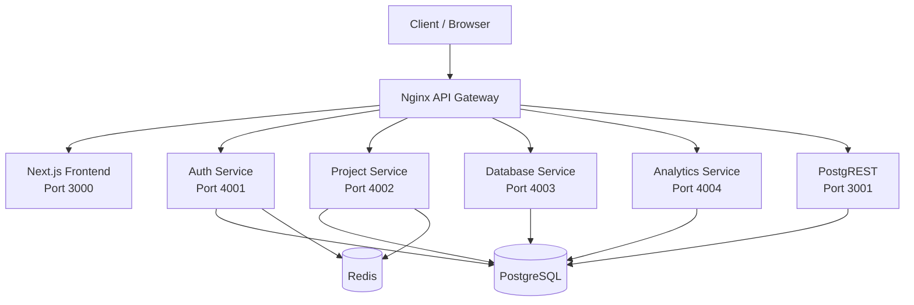
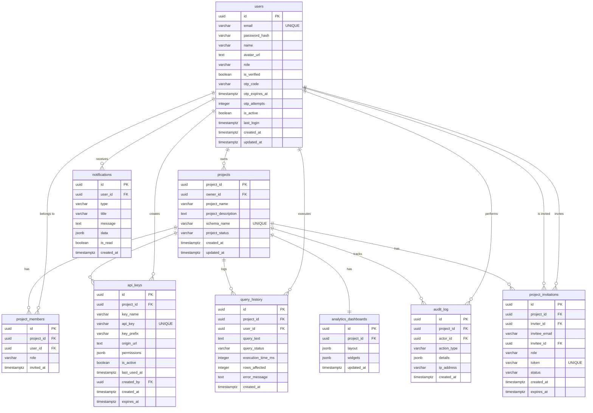

# RapidBase - The Open-Source Backend for Rapid Development

> **Developed by Ayush Soni**

## Objective & Vision
RapidBase is a highly scalable, self-hosted, multi-tenant Backend-as-a-Service (BaaS) designed to be the ultimate open-source alternative to platforms like Firebase and Supabase. The core problem it solves is the complexity of configuring and managing multi-tenant architectures from scratch. RapidBase provides developers with a streamlined dashboard for project management, authentication, database auto-generation (via PostgREST), direct SQL execution, and comprehensive analytics—all isolated perfectly per tenant. The overall goal is to empower developers to launch production-ready applications with robust backend infrastructure and an intuitive management UI in minutes.

## Core Features
1. **Multi-Tenant Postgres Databases**: Instant schema isolation per project.
2. **Auto-Generated REST APIs**: Powered by PostgREST based on your schema.
3. **Advanced Authentication**: JWT, Refresh Tokens, and OTP-based Email authentication.
4. **SQL Editor**: Direct database execution with audit logging and history.
5. **Role-Based Access Control (RBAC)**: Admin, Editor, and Viewer roles for project members.
6. **Analytics & Dashboards**: Fully customizable grid layouts, real-time query metrics, and reporting.
7. **Developer API Keys**: Manage secure programmatic access to projects.
8. **Real-time Notifications**: Invitation systems and system alerts.

## Tech Stack & Module Deep-Dive
- **Next.js (App Router)**: The frontend framework showcasing a highly responsive, animated dashboard UI (TailwindCSS v4, React Flow, Mermaid).
- **Node.js & Express**: Microservices architecture for modular performance handling Auth, Projects, Database querying, and Analytics.
- **PostgreSQL**: The primary relational database ensuring strict schema-level multi-tenancy.
- **Redis**: Caching session states, user rate-limiting, and managing rapid OTP requests to prevent API abuse.
- **PostgREST**: Instantly turns the PostgreSQL database into a RESTful API, eliminating endless CRUD boilerplate.
- **Nginx**: Serving as an API Gateway, Reverse Proxy, and Load Balancer to securely route incoming traffic dynamically.
- **Docker & Docker Compose**: Containerizing the entire platform, making local development, testing, and production deployment reproducible.

## Architectural Diagrams

### System Flow Diagram


### ER Diagram (Core Entities)


## Comprehensive API Documentation

All requests interact with the platform through the unified Nginx API Gateway. Authentication is strictly handled via `Authorization: Bearer <token>` or HTTP-only cookies assigned during Login. All successful responses generally follow a `{ status, data, message }` envelope convention.

### 1. Authentication Service (`/api/auth/*`)
Manages user lifecycle, tokens, and profiles. Limits apply via Redis (e.g., 20 req/15min).

| Method | Endpoint | Input | Success Output | Description |
| :--- | :--- | :--- | :--- | :--- |
| `POST` | `/api/auth/register` | Body: `{ "email", "password", "name" }` | `201` - `{ "status", "data": { "userId" }, "message" }` | Register new user, sends OTP |
| `POST` | `/api/auth/verify-otp` | Body: `{ "email", "otp" }` | `200` - `{ "status", "data": { "user", "token", "refreshToken" } }` | Verify OTP to login |
| `POST` | `/api/auth/resend-otp` | Body: `{ "email" }` | `200` - `{ "status", "data": null, "message" }` | Resend OTP |
| `POST` | `/api/auth/login` | Body: `{ "email", "password" }` | `200` - `{ "status", "data": { "token", "refreshToken" } }` | Login user |
| `POST` | `/api/auth/refresh` | Body: `{ "refreshToken" }` | `200` - `{ "status", "data": { "token", "refreshToken" } }` | Refresh JWT tokens |
| `POST` | `/api/auth/logout` | None (Requires active session) | `200` - `{ "status", "data": null, "message" }` | Logout user |
| `GET` | `/api/auth/me` | Header: `Authorization: Bearer <token>` | `200` - `{ "status", "data": { "id", "email", "name", "verified" } }` | Get current user |
| `PATCH` | `/api/auth/profile` | Body: `{ "name" }` | `200` - `{ "status", "data": { "id", "name" }, "message" }` | Update profile |
| `POST` | `/api/auth/change-password` | Body: `{ "oldPassword", "newPassword" }` | `200` - `{ "status", "data": null, "message" }` | Change password |
| `DELETE` | `/api/auth/account` | None | `200` - `{ "status", "data": null, "message" }` | Delete account permanently |

### 2. Project Service (`/api/projects/*` & `/api/schema/*`)
Handles workspaces, schemas, table configuration, RBAC members, and keys. Requires Auth.

#### Projects
| Method | Endpoint | Input | Success Output | Description |
| :--- | :--- | :--- | :--- | :--- |
| `GET` | `/api/projects/` | Header: `Authorization: Bearer <token>` | `200` - `{ "status", "data": [ { "id", "name", "role", "createdAt" } ] }` | List projects |
| `POST` | `/api/projects/` | Body: `{ "name" }` | `201` - `{ "status", "data": { "id" }, "message" }` | Create project |
| `GET` | `/api/projects/:projectId` | Param: `projectId` | `200` - `{ "status", "data": { "id", "name", "ownerId", "schema" } }` | Get project details |
| `PATCH` | `/api/projects/:projectId` | Body: `{ "name" }` | `200` - `{ "status", "data": { ... }, "message" }` | Update project |
| `DELETE` | `/api/projects/:projectId` | Param: `projectId` | `200` - `{ "status", "data": null, "message" }` | Delete project |

#### Schema & Tables
| Method | Endpoint | Input | Success Output | Description |
| :--- | :--- | :--- | :--- | :--- |
| `GET` | `/api/schema/:projectId` | Param: `projectId` | `200` - `{ "status", "data": { "schema": [...] } }` | Get full schema |
| `GET` | `/api/projects/:projectId/tables` | Param: `projectId` | `200` - `{ "status", "data": [ "users", "products" ] }` | List tables |
| `POST` | `/api/projects/:projectId/tables` | Body: `{ "tableName", "columns": [...] }` | `201` - `{ "status", "data": null, "message" }` | Create table |
| `GET` | `/api/projects/:projectId/tables/:tableName` | Params: `projectId`, `tableName` | `200` - `{ "status", "data": { "columns": [...] } }` | Get table details |
| `PATCH` | `/api/projects/:projectId/tables/:tableName` | Body: `{ "actions": [...] }` | `200` - `{ "status", "data": null, "message" }` | Alter table |
| `DELETE` | `/api/projects/:projectId/tables/:tableName` | Params: `projectId`, `tableName` | `200` - `{ "status", "data": null, "message" }` | Drop table |

#### Table Data (UI CRUD Actions)
| Method | Endpoint | Input | Success Output | Description |
| :--- | :--- | :--- | :--- | :--- |
| `GET` | `/api/projects/:projectId/tables/:tableName/data` | Query: `?limit=50&offset=0` | `200` - `{ "status", "data": [ { "id": 1, "col": "val" } ] }` | Get rows |
| `POST` | `/api/projects/:projectId/tables/:tableName/data` | Body: `{ "row": { ... } }` | `201` - `{ "status", "data": { "id": 1 }, "message" }` | Insert row |
| `PATCH` | `/api/projects/:projectId/tables/:tableName/rows` | Body: `{ "id", "updates": { ... } }` | `200` - `{ "status", "data": null, "message" }` | Update row |
| `DELETE` | `/api/projects/:projectId/tables/:tableName/rows` | Option: Query or Body `{ "id" }` | `200` - `{ "status", "data": null, "message" }` | Delete row |

#### Members & Roles
| Method | Endpoint | Input | Success Output | Description |
| :--- | :--- | :--- | :--- | :--- |
| `GET` | `/api/projects/:projectId/members` | Param: `projectId` | `200` - `{ "status", "data": [ { "userId", "email", "role" } ] }` | List members |
| `POST` | `/api/projects/:projectId/members` | Body: `{ "email", "role" }` | `201` - `{ "status", "data": null, "message" }` | Invite member |
| `PATCH` | `/api/projects/:projectId/members/:memberId` | Body: `{ "role" }` | `200` - `{ "status", "message" }` | Update role |
| `DELETE` | `/api/projects/:projectId/members/:memberId` | Params: `projectId`, `memberId` | `200` - `{ "status", "message" }` | Remove member |

#### Invitations & Notifications
| Method | Endpoint | Input | Success Output | Description |
| :--- | :--- | :--- | :--- | :--- |
| `GET` | `/api/projects/invitations/mine` | None | `200` - `{ "status", "data": [ { "projectId", "role", "token" } ] }` | List my invites |
| `POST` | `/api/projects/invitations/accept/:token` | Param: `token` | `200` - `{ "status", "data": { "projectId" }, "message" }` | Accept invite |
| `POST` | `/api/projects/invitations/decline/:token` | Param: `token` | `200` - `{ "status", "message" }` | Decline invite |
| `GET` | `/api/projects/notifications` | None | `200` - `{ "status", "data": [ { "id", "title", "message", "isRead" } ] }` | List notifications |

#### API Keys
| Method | Endpoint | Input | Success Output | Description |
| :--- | :--- | :--- | :--- | :--- |
| `GET` | `/api/projects/:projectId/keys` | Param: `projectId` | `200` - `{ "status", "data": [ { "id", "createdAt", "lastUsedAt" } ] }` | List API keys |
| `POST` | `/api/projects/:projectId/keys` | None | `201` - `{ "status", "data": { "key" }, "message" }` | Create API key |
| `DELETE` | `/api/projects/:projectId/keys/:keyId` | Params: `projectId`, `keyId` | `200` - `{ "status", "message" }` | Revoke API key |

### 3. Database Service (`/api/query/*` & `/api/auditlog`)

| Method | Endpoint | Input | Success Output | Description |
| :--- | :--- | :--- | :--- | :--- |
| `POST` | `/api/query/execute` | Body: `{ "projectId", "query" }` | `200` - `{ "status", "data": { "rows", "rowCount", "executionTimeMs" } }` | Execute SQL query |
| `GET` | `/api/query/history` | Query: `?projectId=uuid` | `200` - `{ "status", "data": [ { "query", "executedBy", "timestamp" } ] }` | Query history |
| `GET` | `/api/auditlog` | Query: `?projectId=uuid` | `200` - `{ "status", "data": [ { "action", "details" } ] }` | Audit log |

### 4. Analytics Service (`/api/analytics/*`)

| Method | Endpoint | Input | Success Output | Description |
| :--- | :--- | :--- | :--- | :--- |
| `GET` | `/api/analytics/tables` | Query: `?projectId=uuid` | `200` - `{ "status", "data": [ "users", "orders" ] }` | List analytics tables |
| `GET` | `/api/analytics/tables/:tableName/columns` | Query: `?projectId=uuid` | `200` - `{ "status", "data": [ { "name", "type" } ] }` | List columns |
| `GET` | `/api/analytics/chart` | Query: `?projectId`, `tableName`, `xAxis`, `yAxis`, `aggregation` | `200` - `{ "status", "data": [ { "label", "value" } ] }` | Chart data |
| `GET` | `/api/analytics/stats` | Query: `?projectId`, `tableName` | `200` - `{ "status", "data": { "totalRecords", "recentlyAdded" } }` | Table stats |
| `GET` | `/api/analytics/dashboard` | Query: `?projectId=uuid` | `200` - `{ "status", "data": { "layout", "widgets" } }` | Get dashboard config |
| `POST` | `/api/analytics/dashboard` | Body: `{ "projectId", "layout", "widgets" }` | `200` - `{ "status", "data": null, "message" }` | Save dashboard config |

### 5. PostgREST Auto-Generated API (`/api/rest/*`)

The PostgREST API gives you instant, high-performance REST access to your project tables. Every request is authenticated via an API key — no cookies or JWT tokens needed.

#### Authentication

Include your API key in every request:
```bash
curl -H "x-api-key: YOUR_API_KEY" http://YOUR_DOMAIN/api/rest/your_table
```

Generate API keys from: **Dashboard → API Keys → Generate New Key**

#### Read Records

```bash
# Get all rows
curl http://YOUR_DOMAIN/api/rest/users -H "x-api-key: YOUR_KEY"

# Select specific columns
curl "http://YOUR_DOMAIN/api/rest/users?select=id,email" -H "x-api-key: YOUR_KEY"

# Filter: exact match
curl "http://YOUR_DOMAIN/api/rest/users?id=eq.5" -H "x-api-key: YOUR_KEY"

# Filter: greater than
curl "http://YOUR_DOMAIN/api/rest/users?age=gt.18" -H "x-api-key: YOUR_KEY"

# Filter: pattern match (case-insensitive)
curl "http://YOUR_DOMAIN/api/rest/users?name=ilike.*john*" -H "x-api-key: YOUR_KEY"

# Sort + Pagination
curl "http://YOUR_DOMAIN/api/rest/users?order=created_at.desc&limit=10&offset=0" -H "x-api-key: YOUR_KEY"
```

#### Insert Records

```bash
# Single row
curl -X POST http://YOUR_DOMAIN/api/rest/users \
  -H "x-api-key: YOUR_KEY" \
  -H "Content-Type: application/json" \
  -H "Prefer: return=representation" \
  -d '{"full_name": "John Doe", "email": "john@example.com"}'

# Multiple rows
curl -X POST http://YOUR_DOMAIN/api/rest/users \
  -H "x-api-key: YOUR_KEY" \
  -H "Content-Type: application/json" \
  -d '[{"full_name": "Alice"}, {"full_name": "Bob"}]'
```

#### Update Records

```bash
curl -X PATCH "http://YOUR_DOMAIN/api/rest/users?id=eq.1" \
  -H "x-api-key: YOUR_KEY" \
  -H "Content-Type: application/json" \
  -d '{"full_name": "Updated Name"}'
```

> ⚠️ Always include a filter (`?id=eq.X`), otherwise ALL rows will be updated.

#### Delete Records

```bash
curl -X DELETE "http://YOUR_DOMAIN/api/rest/users?id=eq.1" \
  -H "x-api-key: YOUR_KEY"
```

> ⚠️ Always include a filter, otherwise ALL rows will be deleted.

#### JavaScript Example

```javascript
const API_URL = "http://YOUR_DOMAIN/api/rest";
const headers = {
  "x-api-key": "YOUR_KEY",
  "Content-Type": "application/json",
  "Prefer": "return=representation",
};

// Read
const users = await fetch(`${API_URL}/users`, { headers }).then(r => r.json());

// Insert
const newUser = await fetch(`${API_URL}/users`, {
  method: "POST", headers,
  body: JSON.stringify({ full_name: "New User", email: "new@test.com" }),
}).then(r => r.json());

// Update
await fetch(`${API_URL}/users?id=eq.${newUser[0].id}`, {
  method: "PATCH", headers,
  body: JSON.stringify({ full_name: "Updated" }),
});

// Delete
await fetch(`${API_URL}/users?id=eq.${newUser[0].id}`, {
  method: "DELETE", headers,
});
```

#### Filter Operators Reference

| Operator | Meaning | Example |
|----------|---------|---------|
| `eq` | Equals | `?id=eq.5` |
| `neq` | Not equal | `?status=neq.deleted` |
| `gt` / `lt` | Greater / Less than | `?age=gt.18` |
| `gte` / `lte` | Greater/Less or equal | `?price=lte.100` |
| `like` | Pattern match (case-sensitive) | `?name=like.*john*` |
| `ilike` | Pattern match (case-insensitive) | `?name=ilike.*john*` |
| `in` | In list | `?status=in.(active,pending)` |
| `is` | IS (null/true/false) | `?deleted_at=is.null` |

#### Response Codes

| Code | Meaning |
|------|---------|
| `200` | Success (GET, PATCH) |
| `201` | Created (POST with `Prefer: return=representation`) |
| `204` | Success, no content returned |
| `401` | Invalid or missing API key |
| `404` | Table not found |
| `409` | Unique constraint violation |

## Installation & Local Setup

Docker Compose orchestrates the entire application. Follow these steps to get up and running locally in minutes.

### Prerequisites

| Tool | Minimum Version | Purpose |
|------|----------------|---------|
| Docker | 24.x | Container runtime |
| Docker Compose | v2.x | Multi-container orchestration |
| Git | 2.x | Source control |
| (Optional) Terraform | 1.7+ | AWS infrastructure provisioning |
| (Optional) AWS CLI | 2.x | AWS credential management |

### 1. Clone the Repository

```bash
git clone https://github.com/ayushsoni1010/rapidbase.git
cd rapidbase
```

### 2. Configure Environment Variables

```bash
cp .env.example .env
```

Open `.env` and fill in all required values:

| Variable | Description |
|----------|------------|
| `POSTGRES_PASSWORD` | Strong password for PostgreSQL (min 32 chars) |
| `JWT_SECRET` | Random string, min 64 chars — use `openssl rand -hex 64` |
| `JWT_REFRESH_SECRET` | Random string, min 64 chars |
| `COOKIE_SECRET` | Random string, min 32 chars |
| `REDIS_PASSWORD` | Redis password |
| `SMTP_HOST / SMTP_USER / SMTP_PASS` | Real SMTP creds for OTP emails (leave blank for Ethereal dev mode) |

> **Tip:** Generate secrets fast: `openssl rand -hex 64`

### 3. Start the Platform

```bash
docker compose up -d
```

All images (PostgreSQL, Redis, Auth, Project, Database, Analytics, Nginx, Next.js) will pull from Docker Hub automatically.

| Service | URL |
|---------|-----|
| Frontend Dashboard | http://localhost/ |
| Backend APIs (via Nginx) | http://localhost/api/* |
| PostgREST Auto-API | http://localhost/api/rest/* |

### 4. Rebuild After Code Changes (Local Dev Only)

```bash
# Rebuild specific service
docker compose up -d --build auth-service

# Rebuild everything
docker compose up -d --build
```

---

## CI/CD Pipeline — GitHub Actions

The pipeline lives at [`.github/workflows/ci.yml`](.github/workflows/ci.yml) and triggers on every push or PR to `main`.

### Pipeline Stages

```
Push to main
    │
    ▼
┌──────────────────────┐
│  1. Filesystem Scan  │  ← Trivy scans source code for HIGH/CRITICAL CVEs
└──────────┬───────────┘
           │ (on pass)
    ┌──────▼──────────────────────────┐
    │  2. Build & Push (matrix x 6)   │  ← Parallel per service:
    │                                 │    docker build → Trivy image scan → docker push
    │  auth-service                   │
    │  project-service                │
    │  database-service               │
    │  analytics-service              │
    │  nginx-gateway                  │
    │  frontend                       │
    └──────┬──────────────────────────┘
           │ (all pass)
    ┌──────▼──────────────────┐
    │  3. Success Notification │  ← Email sent via Gmail SMTP
    └─────────────────────────┘
```

Each service is tagged with both a unique run ID (`<run_id>-<short_sha>`) and `:latest`. Failure at any stage sends an HTML alert email with the scan report attached.

### Required GitHub Repository Secrets

Go to **Settings → Secrets and variables → Actions → New repository secret** and add:

| Secret Name | Description |
|-------------|------------|
| `DOCKERHUB_USERNAME` | Your Docker Hub username |
| `DOCKERHUB_TOKEN` | Docker Hub Access Token (not your password) — create at hub.docker.com → Security |
| `MAIL_USERNAME` | Gmail address used to send CI alerts |
| `MAIL_PASSWORD` | Gmail App Password (not your account password) — create at myaccount.google.com → Security → App passwords |
| `ALERT_EMAIL_ADDRESS` | Recipient email for CI success/failure notifications |

### Generating a Gmail App Password

1. Go to [myaccount.google.com/apppasswords](https://myaccount.google.com/apppasswords)
2. Select **Mail** and **Other (Custom name)** → enter "RapidBase CI"
3. Copy the 16-character password → use as `MAIL_PASSWORD`

### Pulling the Latest Images on Your Server

After CI has pushed new images, SSH into your EC2 instance and run:

```bash
docker compose pull && docker compose up -d
```

---

## Infrastructure as Code — Terraform (AWS)

All AWS infrastructure is defined in the [`terraform/`](./terraform/) directory. The setup provisions:
- An EC2 instance (default: `m7i-flex.large`, 30 GB gp3 SSD)
- A security group with ports 22 (SSH), 80 (HTTP), 5050 (pgAdmin), 8001 (Redis Commander)
- An SSH key pair from your local public key
- Docker auto-installed via the `scripts/install_docker.sh` user-data script

### Prerequisites

```bash
# Install Terraform
sudo apt-get install -y gnupg software-properties-common
wget -O- https://apt.releases.hashicorp.com/gpg | gpg --dearmor | sudo tee /usr/share/keyrings/hashicorp-archive-keyring.gpg
echo "deb [signed-by=/usr/share/keyrings/hashicorp-archive-keyring.gpg] https://apt.releases.hashicorp.com $(lsb_release -cs) main" | sudo tee /etc/apt/sources.list.d/hashicorp.list
sudo apt update && sudo apt-get install terraform

# Configure AWS credentials
aws configure
# Enter: AWS Access Key ID, Secret Key, Region (e.g. ap-south-1), output format (json)
```

### Deploy Infrastructure

```bash
cd terraform/

# 1. Initialize providers & modules
terraform init

# 2. Preview the changes
terraform plan

# 3. Apply — creates EC2 instance, security group, and key pair
terraform apply
```

After `apply`, Terraform outputs:
```
public_ip  = "X.X.X.X"
public_dns = "ec2-X-X-X-X.ap-south-1.compute.amazonaws.com"
```

### Connect & Deploy to EC2

```bash
# SSH into the instance (Docker is auto-installed via user-data)
ssh -i ../rapidbase_ssh_key ubuntu@<public_ip>

# On the EC2 instance — clone the repo and start services
git clone https://github.com/ayushsoni1010/rapidbase.git
cd rapidbase
cp .env.example .env
nano .env          # fill in your production secrets
docker compose up -d
```

### Configurable Terraform Variables

Defaults are in [`terraform/variable.tf`](./terraform/variable.tf). Override with `-var` or a `terraform.tfvars` file:

| Variable | Default | Description |
|----------|---------|-------------|
| `ami_id` | `ami-03446a3af42c5e74e` | Ubuntu 22.04 LTS AMI (ap-south-1) |
| `instance_type` | `m7i-flex.large` | EC2 instance type |
| `root_storage` | `30` | Root EBS volume size in GB |

```bash
# Example — override instance type
terraform apply -var="instance_type=t3.medium"
```

### Tear Down Infrastructure

```bash
cd terraform/
terraform destroy
```

> ⚠️ This will permanently delete your EC2 instance and all associated resources. Backup your data first.

---

## License

This project is licensed under the **MIT License** — see the [LICENSE](./LICENSE) file for full text.

```
MIT License

Copyright (c) 2026 Ayush Soni

Permission is hereby granted, free of charge, to any person obtaining a copy
of this software and associated documentation files (the "Software"), to deal
in the Software without restriction, including without limitation the rights
to use, copy, modify, merge, publish, distribute, sublicense, and/or sell
copies of the Software, and to permit persons to whom the Software is
furnished to do so, subject to the following conditions:

The above copyright notice and this permission notice shall be included in all
copies or substantial portions of the Software.

THE SOFTWARE IS PROVIDED "AS IS", WITHOUT WARRANTY OF ANY KIND, EXPRESS OR
IMPLIED, INCLUDING BUT NOT LIMITED TO THE WARRANTIES OF MERCHANTABILITY,
FITNESS FOR A PARTICULAR PURPOSE AND NONINFRINGEMENT. IN NO EVENT SHALL THE
AUTHORS OR COPYRIGHT HOLDERS BE LIABLE FOR ANY CLAIM, DAMAGES OR OTHER
LIABILITY, WHETHER IN AN ACTION OF CONTRACT, TORT OR OTHERWISE, ARISING FROM,
OUT OF OR IN CONNECTION WITH THE SOFTWARE OR THE USE OR OTHER DEALINGS IN THE
SOFTWARE.
```
